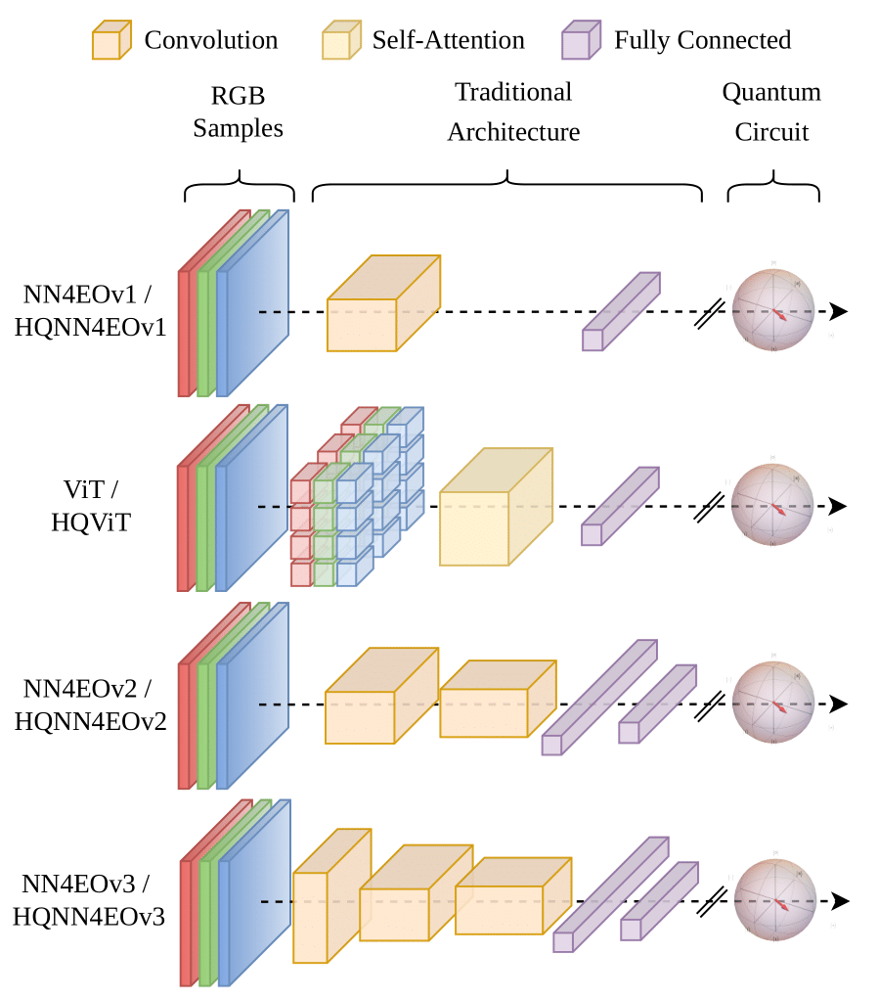

# Evaluating Key Design Aspects in Simulated Hybrid Quantum Neural Networks for Earth Observation

This repository contains code and resources to explore key design aspects of Hybrid Quantum Neural Networks (HQNN) applied to Earth Observation (EO) tasks. The study examines how quantum-enhanced models perform in EO, focusing on three main areas: performance comparison of quantum libraries, stability under varying initialization values, and the advantages of hybrid quantum attention-based architectures. This work aims to provide foundational insights for future EO applications using quantum neural networks, especially in the context of emerging post-NISQ technologies.

## Getting Started

To run the code, you can use the following Docker images:

- **For Qiskit models**: `lorenzopapa5/cuda12.1.0-python3.8-pytorch2.4.0-esa`
- **For PennyLane models**: `lorenzopapa5/cuda12.1.0-python3.8-pytorch2.4.0-esa-hqm`

These images include all necessary dependencies, including CUDA, Python 3.8, PyTorch 2.4.0, and respective quantum libraries for the models used in this study.

### Running the Code

- **To run Qiskit models**, execute: `main_binary_qkit.py`
- **To run PennyLane models**, execute: `main_binary_pl.py`

Ensure you are using the correct Docker image, which depends on the model you are running.
To execute a main file within a Docker container, use the following pseudocode to set up paths and options as needed:

```bash
docker run \
    -v /path/to/your/project:/work/project/ \          # Maps local project directory to Docker
    -v /path/to/your/dataset:/work/dataset/ \          # Maps local dataset directory to Docker
    -v /path/to/save/results:/work/save_models/ \      # Maps save directory for results
    -u user_id:group_id --ipc host --gpus all your_docker_image /usr/bin/python3 /work/project/main_file.py \
    --model_name <model_name> --c1 <class1> --c2 <class2>
```

## Model Architectures



## Results

### Quantum Models Comparison over Qiskit and PennyLane Libraries

| Models     | Qiskit $\overline{Acc}$ | Qiskit $k^*$ | PennyLane $\overline{Acc}$ | PennyLane $k^*$ |
|------------|--------------------------|---------------------|----------------------------|------------------------|
| HQNN4EOv1  | **91.93**                | 16.31              | 91.80                      | **15.53**              |
| HQNN4EOv2  | 92.35                    | 16.36              | **92.51**                  | **16.11**              |
| HQNN4EOv3  | **93.45**                | 15.89              | 93.15                      | **15.46**              |
| HQViT      | **87.95**                | 16.25              | 87.77                      | **16.20**              |

### Model's Comparison over $k$ Initialization Values

| Models      | Traditional $\overline{Acc}$ | Traditional $\overline{\sigma}^2$ | Quantum $\overline{Acc}$ | Quantum $\overline{\sigma}^2$ |
|-------------|------------------------------|------------------------------------|---------------------------|--------------------------------|
| NN4EOv1 / HQNN4EOv1 | 90.87              | 3.85                               | **90.90**                | **3.25**                       |
| NN4EOv2 / HQNN4EOv2 | **92.66**           | **4.25**                           | 92.56                    | 4.44                            |
| NN4EOv3 / HQNN4EOv3 | 93.00               | 2.72                               | **93.47**                | **2.45**                       |
| ViT / HQViT         | 88.37               | **3.47**                           | **88.78**                | 7.77                            |

## Paper

For more details on the design aspects and methodologies used in this study, please refer to our [arXiv paper](https://arxiv.org/abs/2410.08677).

## Citation

If you use this code or reference our work, please cite our paper as follows:

```bibtex
@article{papa2024impact,
  title={On the impact of key design aspects in simulated Hybrid Quantum Neural Networks for Earth Observation},
  author={Papa, Lorenzo and Sebastianelli, Alessandro and Meoni, Gabriele and Amerini, Irene},
  journal={arXiv preprint arXiv:2410.08677},
  year={2024}
}
